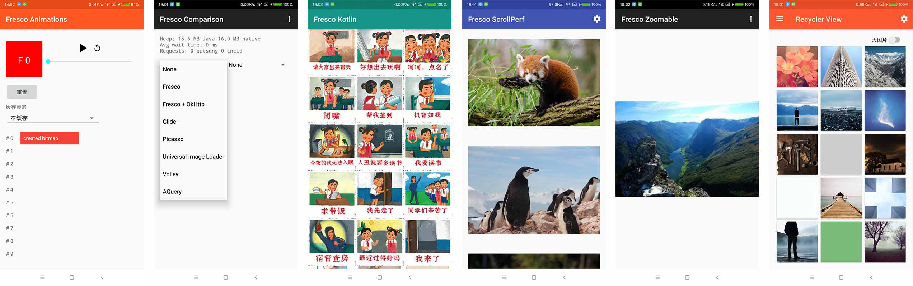

>基于Fresco 2.0.0

## 工程结构
工程名|描述|下载APK
-|-|-
animation2 | 动图示例|[animation2.apk](https://raw.githubusercontent.com/dengyuhan/FrescoSample/master/apk/animation2-universal-debug.apk)
comparison | 结合其它http和图片加载框架的示例|[comparison.apk](https://raw.githubusercontent.com/dengyuhan/FrescoSample/master/apk/comparison-universal-debug.apk)
kotlin | Kotlin版的示例|[kotlin.apk](https://raw.githubusercontent.com/dengyuhan/FrescoSample/master/apk/kotlin-universal-debug.apk)
scrollperf | 列表的示例|[scrollperf.apk](https://raw.githubusercontent.com/dengyuhan/FrescoSample/master/apk/scrollperf-debug.apk)
zoomableapp | 图片缩放的示例|[zoomableapp.apk](https://raw.githubusercontent.com/dengyuhan/FrescoSample/master/apk/zoomableapp-internal-armeabi-v7a-debug.apk)
showcase | 所有功能的示例 |[showcase.apk](https://raw.githubusercontent.com/dengyuhan/FrescoSample/master/apk/showcase-normal-armeabi-v7a-debug.apk)

## 编译
如果编译出现`ndk-build`的异常，升级NDK即可
